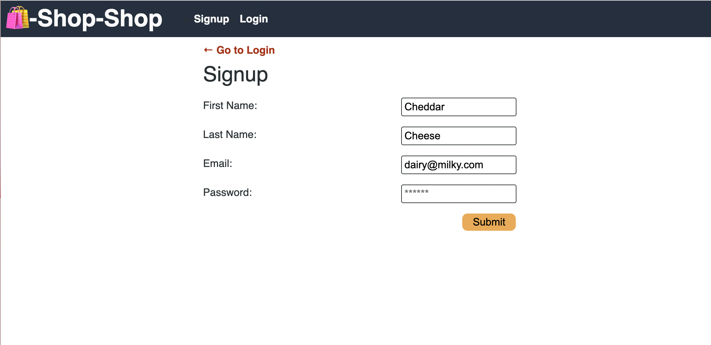
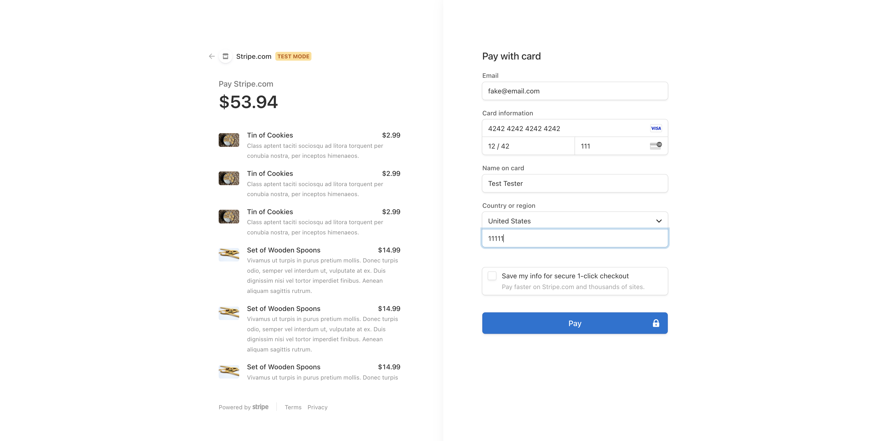
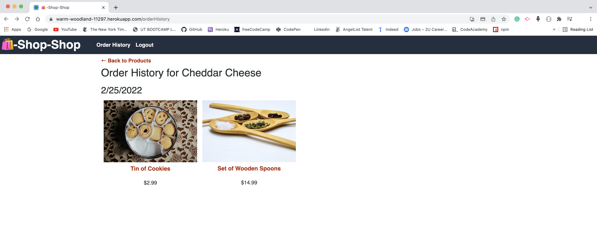

# Redux-Store

This is a modified e-commerce platform project that incorporates Redux. 

# Description
The e-commerce platform manages global state from Redux over the previous Context API used from the previous deployed version of the application. The store uses Redux Store for its front-end access to determine site changes, pass through reducers, extract state data, and dispatch data sans the use of the Context API. 

Users are able to register on the site, added their purchases from the main page and the respective item page, and checkout their purchases on the website. They can also review their order history from the website. These interactions function with Redux store.

## Table of Contents
- [Description](#Description)
- [Installation](#Installation)
- [Usage](#Usage)
- [Developed With](#Developed-with)

# Installation
- This application is online and deployed from Heroku. It can be cloned into your local repository from GitHub using the above Code button.
- The following npm packages listed in the `Developed With` tab are required to be installed in both client and server files in order to test the application. Use `npm i` in the Terminal to install them and `npm run start` to run the test server of the website (with installation of concurrently).

# Usage
- Deployed Application:
https://warm-woodland-11297.herokuapp.com/

- GitHub Repository:
https://github.com/trujilml/redux-store

# Developed With
- MERN Stack: MongoDB, Express.js, React, Node.js
- Redux
- Apollo-Server-Express
- Apollo/Client
- Mongoose
- Stripe
- Concurrently
- GraphQL
- Heroku
- JavaScript
- CSS